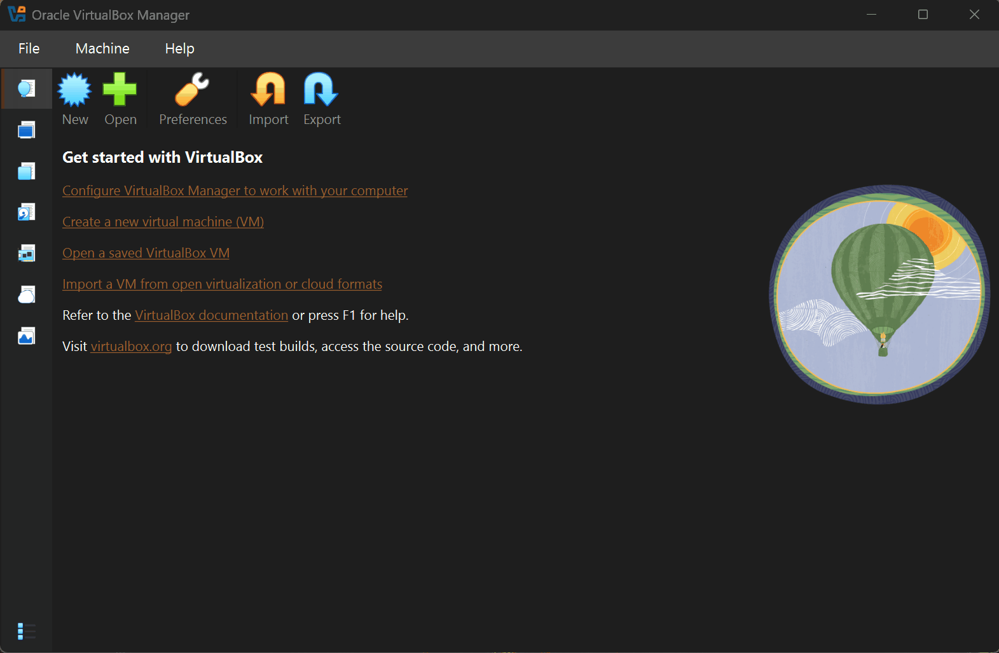
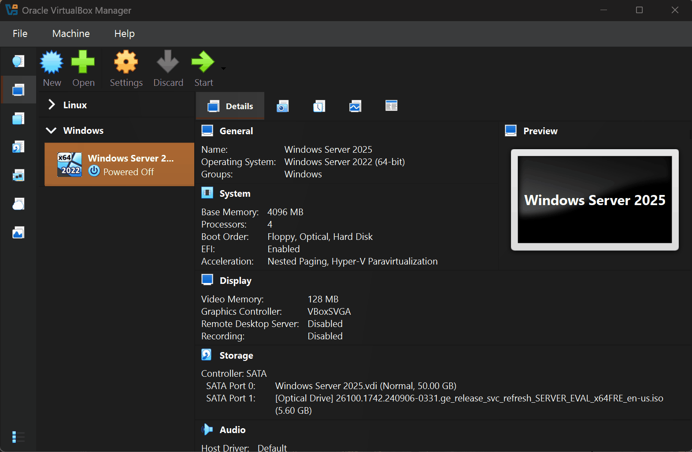
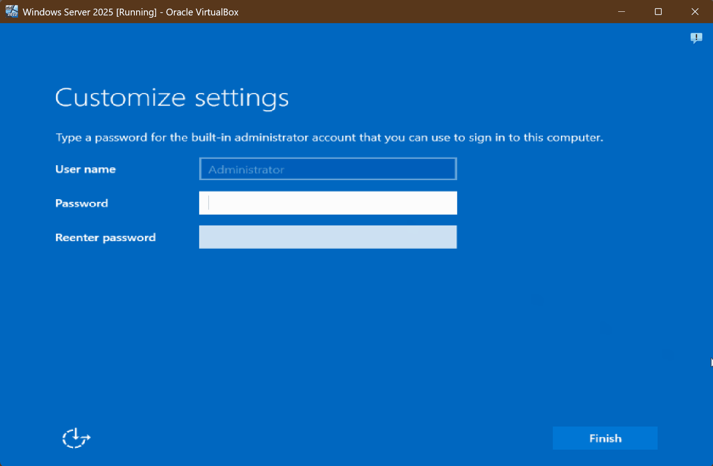

## $${\color{hotpink}Getting \space Started \space with \space Windows \space Server \space and \space Active \space Directory}$$

### Overview
- <b>Windows Server 2025</b>, <b>Active Directory</b> and <b>Windows 11</b> will be deployed inside <b>Oracle VirtualBox VM</b>
    <ul>To keep the installation simple, default configuration will be used.
    </ul>
  

<!--------------REQUIREMENTS--------------->

<b>Requirements</b>

<ol><b>Oracle VirtualBox VM</b></ol>
<ol>Internet connection</ol>    
<ol>Patience</ol>

 

<!--------------NOTES--------------->

<b>Notes</b>

<ol>This whole installation process can also be achieved with other virtualization platforms like <b>Hyper-V</b>,  
which is included as an optional feature in <b>Windows 10|11 Pro</b>, <b>Enterprise</b>, and <b>Education</b> editions.</ol>
<b>DISCLAIMER:</b> 
Installations in GIFs are sped up to keep them watchable. 
Actual installation will require more time(+30min).

 

<!--------------TABLEofCONTENTS--------------->

<b><b>Table of Contents</b></b>
 
<ol>
<a href="#overview">Overview</a>
</ol>

<ol>
<a href="#gif1">Windows 11 ISO Aquisition »</a>
    <ul>
    <a href="#gif1.2">Installation »</a>
    </ul>
</ol>

<ol>
<a href="#gif2">Windows Server 2025 ISO Aquisition »</a>
    <ul>
    <a href="#gif3">New VM »</a> 
    <a href="#gif4">Boot Setup »</a> 
    <a href="#gif5">Installation »</a> 
    <a href="#gif6">New VM »</a>
    </ul>
</ol>

<ol>
<a href="#gif7">Active Directory</a>
</ol>

 

<!--------------gif1--------------->

## :window: Windows 11 ISO Aquisition & Installation

Launch your browser and head over to <b>Microsoft's official site</b> and download <a href="https://www.microsoft.com/en-us/software-download/windows11"><b>Windows 11 Disk Image ISO</b> for x64 device</a>: 
 
 

  

<!--gif1-->

<!--gif1.2-->

Open <b>Oracle VirtualBox VM</b> and attach the <a href="https://www.microsoft.com/en-us/software-download/windows11"><b>Windows 11 ISO</b></a> to a new virtual machine: 
 
 

<!--gif1.2-->

 
 
 

<!--gif2-->

## :file_cabinet: Windows Server 2025 ISO Aquisition & Installation

Head over to <a href="https://www.microsoft.com/en-us/evalcenter/evaluate-windows-server-2025"><b>Microsoft's official site</b></a>, complete the registration, and download the <b>Windows Server 2025 Evaluation edition ISO for x64 devices</b>:
 
 

<!--gif2-->

 
 

<!--gif3-->

Open <b>Oracle VirtualBox VM</b>, create a <b>new virtual machine</b>, attach the <b>Windows Server ISO</b>, and <b>allocate resources</b>: 
 
 

<!--gif3-->

 
 

<!--gif4-->

Start the new <b>Windows Server 2025 VM</b> select the ISO boot file, and complete the <b>Windows Server Setup</b>: 
 
 

<!--gif4-->

 
 

<!--gif5-->

Finish installing <b>Windows Server 2025</b>:  **Restart the virtual machine as many times as needed**
 
 

<!--gif5-->

 
 

<!--gif6-->

Once <b>Windows Server 2025</b> is installed, create a new password for the default <b>Administrator account</b> and log in: 
 
 

<!--gif6-->

<h2 align="center"><b>CONGRATULATIONS</b> 🎉🎉🎉</h2>
<h4 align="center">🎊 You just installed <b>Windows Server 2025</b> 🎊 
</h4>
 
 
 

<!--gif7-->

## :card_file_box: Active Directory

Install <b>Active Directory</b> by selecting the <b>Add roles and features</b> option in the <b>Server Manager</b>: 
 
 

  

<!--gif7-->

<!--gif8-->
### User, Group, and Object Management

Log into <b>Windows Server 2025</b> and add a new <b>Organizational Unit</b>: 
 
 

  

<!--gif8-->

<h2 align="center"><b>🎉🎉🎉 CONGRATULATIONS</b> 🎉🎉🎉</h2>
<h4 align="center">🎊 You just Installed <b>Active Directory!</b> 🎊</b>  
Now you are ready for some centralized management!🥳</h4>

(<a href="#readme-top"><strong>back to top »</strong></a>)

 
 
 
